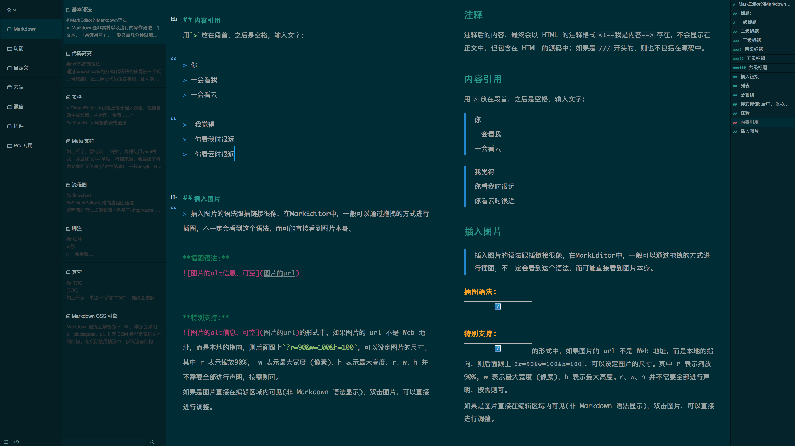

# MarkEditor Theme: Solarized-dark

## Preview

## Intro
主题为 MarkEditor 2.0 制作。个人测试版本为：1.9.9.1（ 即 2.0.6.7）。  
本主题使用字体：Monaco，可自行安装。  
主题使用方法：[如何应用一个视觉主题](https://we.markeditor.com/post/how-to-use-a-gui-theme#main)

## Reference
[Solarized+XL](https://styles.ulyssesapp.com/bundle/Solarized+XL/54aa19c4eaf6ea68210790dd)
[solarized](http://ethanschoonover.com/solarized)
[One Dark Pro](https://binaryify.github.io/OneDark-Pro/#/?id=commonly-used-theme-colors)

## Update
- 2018.05.29 | 发布